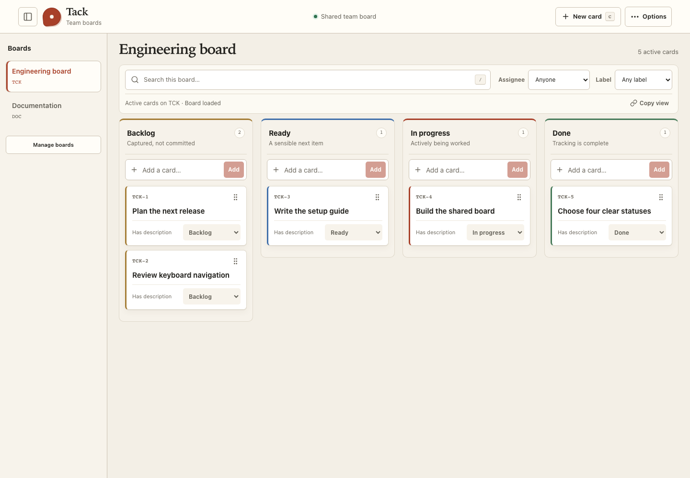

# Tack

**A shared issue board that starts with a title.**

Tack is a self-hosted issue tracker for small development teams. Capture a card,
move it through Backlog, Ready, In progress, and Done, and add context as you go.
Your team and local agents work with the same boards.

[Project site](https://p2dev.github.io/tack/) · [Documentation](docs/README.md) · [Report an issue](https://github.com/P2Dev/tack/issues) · [MIT license](LICENSE)



## Start locally

You need **Git, Docker with Compose, and OpenSSL**. On Windows, run these commands
in WSL or Git Bash with Docker Desktop running.

```sh
git clone https://github.com/P2Dev/tack.git
cd tack
./scripts/setup.sh
docker compose up -d --build --wait
```

Open **[localhost:3000](http://localhost:3000)**. Sign in with
`TACK_ADMIN_EMAIL` and `TACK_ADMIN_PASSWORD` from the generated `.env` file.
The first board starts empty. Create your first card, then add colleagues through
**Options → Team**.

The setup script generates random secrets and preserves an existing `.env`.
The app and database listen on loopback by default. For team access over the LAN
or Internet, follow the [HTTPS deployment guide](docs/DEPLOYMENT.md).
[Manual setup and port changes](docs/SETUP.md) are also documented.

## What you can do

- Capture a title, autosave notes, assign a teammate, and add labels.
- Switch boards in place using a collapsible sidebar; use one status at a time on mobile.
- Give cards readable keys such as `ENG-42`; move cards between boards while keeping old links working.
- Archive and restore cards, search by title/key, and share filtered views.
- Sign in locally or through configured Cognito/OIDC providers.
- Create scoped API keys and connect local agents through the HTTP API or optional MCP adapter.

Administrators manage accounts, boards, and labels and export JSON/CSV snapshots.
All signed-in members share all boards; API keys can be restricted to selected
boards. Tack deliberately keeps four statuses and leaves review, QA, sprints,
and notifications to other tools.

## Documentation

| I want to… | Guide |
| --- | --- |
| Install Tack | [Setup](docs/SETUP.md) |
| Learn the everyday workflow | [User guide](docs/USER_GUIDE.md) |
| Configure environment variables | [Configuration](docs/CONFIGURATION.md) |
| Deploy, upgrade, back up, or restore | [Operations](docs/DEPLOYMENT.md) |
| Configure Cognito or another identity provider | [Authentication](docs/AUTHENTICATION.md) |
| Connect an agent or call the API | [API keys, HTTP API, and MCP](docs/agent-access/README.md) |
| Work on the code | [Development](docs/DEVELOPMENT.md) and [Contributing](CONTRIBUTING.md) |
| Resolve a setup or runtime problem | [Troubleshooting](docs/TROUBLESHOOTING.md) |

The [documentation index](docs/README.md) also links the architecture, design
decisions, verification records, and project-site publishing instructions.

## Development

Use **Node.js 24.9+** and **pnpm 11.9+**. With `.env` generated as above:

```sh
pnpm install --frozen-lockfile
docker compose up -d db
pnpm db:migrate
pnpm db:bootstrap
pnpm dev
```

Run the app container and the development server separately if they use the same
port. The [development guide](docs/DEVELOPMENT.md) covers tests and optional
sample data. The [project site](docs/PROJECT_SITE.md) is built from these Markdown
guides and published through GitHub Pages.

## License

[MIT](LICENSE) © 2026 p2dev.
