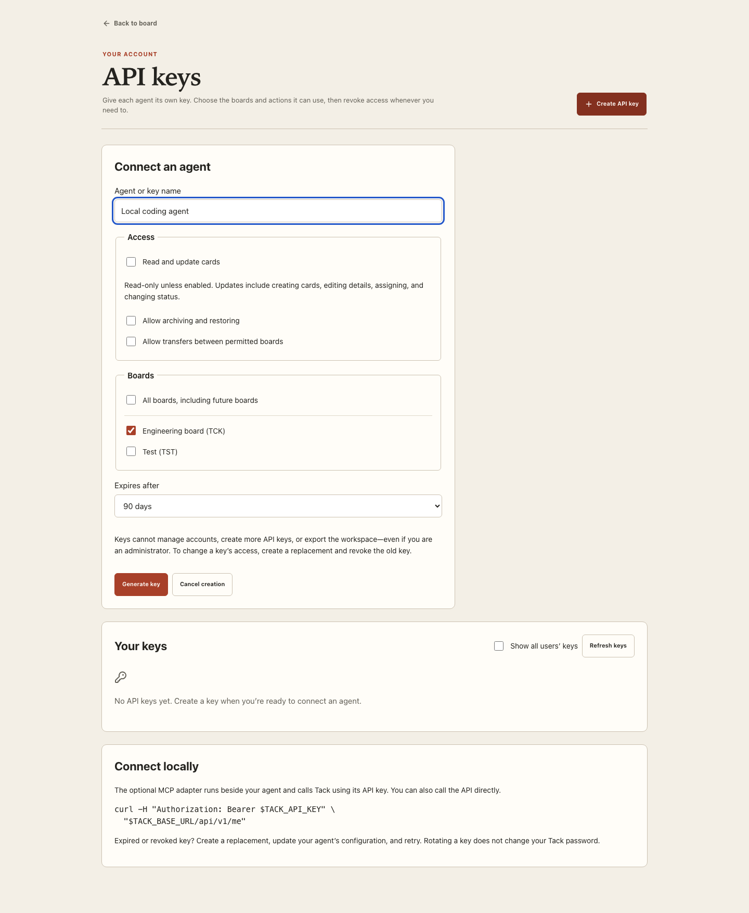
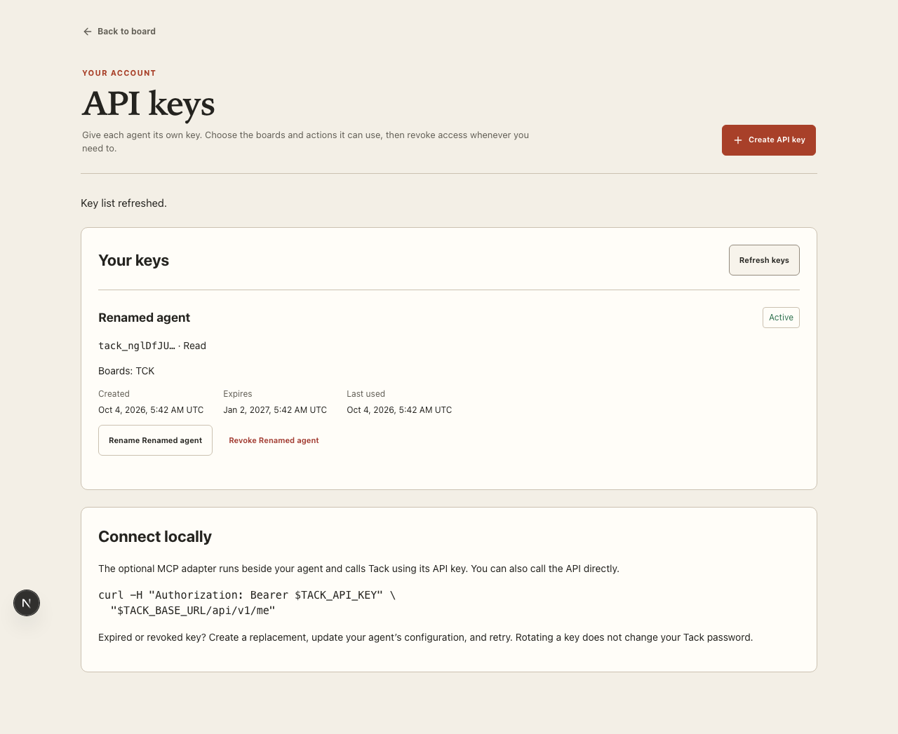
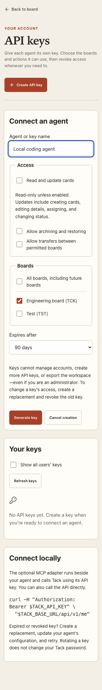

# User API keys and local MCP — delivery

Date: 2026-10-04

## Delivered

All active members can open **Options → API keys**, create a named key, select boards and permissions, copy its secret once, inspect its expiry/last use, rename it, and revoke it. Local and provider-backed accounts share this flow. Administrators can inspect other users’ key metadata and revoke access without recovering secrets.

The versioned `/api/v1` API supports boards, card search/current/former-key reads, label/assignee metadata, creation, edits, movement, transfer, archive, and restore. Keys default to read-only and the selected board. Optional write/archive/transfer scopes are enforced server-side; transfers require both boards. Account disable/delete, expiration and revocation stop subsequent access. Keys cannot authenticate browser/account administration, export data, or issue additional credentials.

Every mutation uses an atomic 24-hour idempotency record. Card revisions advance for both human and agent changes; stale agent writes receive a conflict. Replay checks current access, including cards that moved between boards. Hash-only credential storage uses the version-matched Better Auth API-key 1.6.25 package, with browser-session emulation and alternate HTTP key-management paths disabled.

The optional local stdio MCP adapter exposes 11 tools using official SDK 1.32.0. It accepts the Tack origin/key through the environment, refuses redirects, bounds requests/responses, and carries explicit retry IDs and revisions. It opens no central MCP listener.

## Verification

- **38 unit/integration tests passed** across seven files. New coverage includes concurrent identical creation, conflicting retry input, browser/agent revision conflicts, scopes and both-board transfers, old aliases and cached-result authorization, archive/restore, sanitized assignees, revocation/expiry/disabled owners, and OIDC-session key management with real hashing and rate-limit verification.
- **76 full desktop/mobile browser tests passed; six intentional skips.** Existing board, navigation, Team, provider, export, recovery, responsive and accessibility checks remain green. The new protocol test is run once on desktop because it is viewport-independent.
- **Five focused agent checks passed, one duplicate skipped** after the final admin-control fix. The real SDK client performs list → create → retry → read → update → move → archive, sees revision conflicts and revoked-key errors, and its edits appear in the browser. Member self-service and administrator revocation run on both viewports.
- Final metadata-display checks cover desktop and 320-pixel layouts. Key dates use explicit UTC to avoid server/browser timezone hydration differences. Axe scans cover the form and populated list; revocation moves focus to Cancel first.
- Typecheck, lint and the Docker production build passed. Production form checks at **1440, 390 and 320 px** found no horizontal overflow, zero axe violations, and zero page exceptions.
- A database backup was taken before migration at `backups/tack-before-agent-access-20261004.dump`. Read-only hashes confirm existing business data is unchanged: **two boards, seven cards, eight issue-key records, four labels, and zero card-label relationships**. Hash comparison excludes only the newly added `revision` column. Test mutations use disposable schemas.

The admin-wide key checkbox initially waited for its network request before showing the new selection; focused testing caught and corrected that interaction. The plugin’s actual rate-limit code was also verified and mapped to HTTP 429 with retry guidance.

## Local delivery and remaining deployment work

The production review copy runs at [localhost:3000](http://localhost:3000), with the app port bound to loopback. Migration `003_agent_access.sql` is applied. No production board/card edits were made for acceptance.

Implementation is complete for local review. **LAN deployment is not performed.** Choose the host, stable HTTPS address, trusted certificate, and actual agent client, then verify from a separate LAN machine. AWS Cognito tenant acceptance remains dependent on real provider configuration. The MCP evidence uses the official SDK client; no particular desktop-agent configuration is claimed as tested.

Use the [connection guide](README.md) for key creation, API examples, MCP launch configuration, error handling and LAN checks. The [original plan](PLAN.md) remains the design record.

## Screenshots

Production key creation on desktop:

Member key metadata and actions, using isolated test data:

Production form at 320 pixels:

