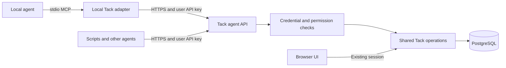

# User API keys and local agents

October 4, 2026 · Research and implementation proposal

**Selected direction:** user-owned API keys, a documented HTTP API, and an optional local MCP adapter. Each agent host runs its own adapter; the adapter calls the shared Tack instance over the LAN. A central MCP endpoint is outside this first target.

This document records source inspection and design decisions. No application code, credentials, dependencies, running services, or network exposure changed during this investigation.

## Recommended shape

The adapter translates tool calls; Tack remains responsible for identity, permissions, validation, and mutations. It receives no database credentials. Scripts can use the API without installing MCP.

## What is already available

- [Authentication](../../src/lib/auth.ts) uses Better Auth **1.6.25**, local accounts, and configurable OIDC/Cognito sign-in. API keys should belong to the same Tack user ID regardless of sign-in method.
- [Request guards](../../src/lib/auth-guards.ts) currently require a browser session. There is no configured API-key verification path.
- Existing routes support board listing, card creation/editing/movement/transfer/archive/restore, and administrator operations. These are UI-oriented routes, not a scoped agent contract.
- [IssueStore](../../src/lib/issue-store.ts) already provides transactional mutations and lookup by current or former key. The current card route exposes PATCH, but no corresponding single-card GET contract for agents.
- Board snapshots include workspace metadata and member profiles. Agent responses need explicit projections rather than returning these snapshots unchanged.
- Card creation has no idempotency key; text updates have no stale-revision precondition. Those gaps matter when an agent retries or edits alongside a person.
- [Deployment guidance](../../README.md) already requires TLS outside localhost and keeps PostgreSQL on loopback. The current localhost review instance is not evidence of LAN deployment readiness.

## API-key policy and user flow

Recommended defaults, to be implemented with the feature:

| Decision | Proposed behavior |
| --- | --- |
| Entry point | **Options → API keys**, available to every active member; independent of administrator-only Team |
| Ownership | One named key per agent or automation, owned by the signed-in Tack user |
| Access preset | Read-only by default; an explicit “Read and update cards” choice |
| Board scope | Select boards; preselect the current board. “All boards, including future boards” is an explicit alternative |
| Extra actions | Archive/restore and cross-board transfer are separately selectable capabilities |
| Lifetime | 90-day default; selectable shorter durations; a visible expiration date |
| Secret handling | High-entropy opaque key, recognizable prefix, hash-only storage, plaintext shown once |
| Management | Show name, prefix, permissions, boards, creation/expiry, last use, and active/revoked state |
| Revocation | Owner can revoke; administrators can revoke another user's keys without retrieving their secrets |
| Account changes | Recheck account eligibility on every request. Disabled/deleted owners cannot use keys; re-evaluate current role rather than embedding a permanent role grant |

Creation retains non-secret form fields after validation failure. The one-time result says “Copy this key now; it will not be shown again,” provides a selectable fallback if clipboard access fails, and shows an API connection example. Do not place the secret in browser storage or URLs. If the response is lost, the key list exposes the newly created record so the user can revoke it and create a replacement.

Rotation means creating a replacement, testing it, then revoking the old key. Revocation feedback identifies the affected agent. Active requests already committed remain committed; subsequent requests fail authentication.

Local and provider-backed accounts use the same flow. Add the new account page to Tack's existing sign-in return-path allowlists so reauthentication returns users to key management.

## Authentication and permission boundary

Use `Authorization: Bearer <tack-key>` on the agent API. Keep browser sessions and key-management endpoints separate: a key must not mint another key, reset passwords, change users, manage boards/labels, or download workspace exports, even when its owner is an administrator.

Prefer the dedicated **Better Auth API-key package**, which supplies key lifecycle, expiry, verification, and rate-limiting primitives. At proposal time it was not installed here; online documentation was newer than Tack's installed auth version. Implementation verified and pinned `@better-auth/api-key@1.6.25` with Better Auth 1.6.25. The first implementation step must verify a compatible package version, schema, and owner-disable behavior. Keep key-to-browser-session emulation disabled and apply Tack's scope checks after verification. A plugin does not automatically authorize Tack routes. [Better Auth API-key documentation](https://better-auth.com/docs/plugins/api-key), [reference](https://better-auth.com/docs/plugins/api-key/reference).

Use Tack-owned, session-protected management handlers to set permitted scopes and board IDs. Ensure any plugin-provided alternate creation/update endpoints cannot bypass those restrictions. If compatibility requires a broad auth upgrade, reassess the dependency before adopting it; a small isolated token store is the fallback, not a reason to change human login unnecessarily.

The API credential context should contain `userId`, `keyId`, allowed operations, and board scope. Explicitly supplied invalid credentials fail; they do not fall back to a browser cookie. Verify once per request and reuse the result. Enforce board authorization against the stored card and within the mutation transaction; never trust only the caller's board parameter. Transfers require both source and destination access, including retries. Old-key lookup checks the card's current board before returning it.

## Agent API and MCP tools

Add a versioned `/api/v1` surface backed by the existing operations. Preserve the browser routes and their response shapes. Put common validation and mutation rules in shared code so API/MCP behavior cannot diverge.

| Task | Proposed API | Proposed MCP tool |
| --- | --- | --- |
| Check identity and granted capabilities | `GET /api/v1/me` | `tack_get_access` |
| List permitted boards | `GET /api/v1/boards` | `tack_list_boards` |
| Search/list cards, including optional archive filter | `GET /api/v1/cards` | `tack_list_cards` |
| Read current or former card key | `GET /api/v1/cards/{key}` | `tack_get_card` |
| Get valid assignees and labels | `GET /api/v1/boards/{id}/metadata` | `tack_get_board_metadata` |
| Create in an explicit board and status | `POST /api/v1/cards` | `tack_create_card` |
| Edit title/description/assignee/labels | `PATCH /api/v1/cards/{id}` | `tack_update_card` |
| Change status or ordering | `POST /api/v1/cards/{id}/move` | `tack_move_card` |
| Transfer between permitted boards | `POST /api/v1/cards/{id}/transfer` | `tack_transfer_card` |
| Archive or restore | `POST /api/v1/cards/{id}/archive` or `/restore` | `tack_archive_card`, `tack_restore_card` |

Reads return stable IDs, current keys, board IDs, archive state, revisions, and canonical browser links. Former-key lookup returns the current identity explicitly. Metadata exposes assignable IDs/names and labels, without account email addresses or administrative details. Lists use bounded pagination and server-side filters; a board-limited key must not reveal other boards through results or counts.

Use machine-readable error codes for invalid/expired credentials, insufficient capability, unavailable cards, invalid input, conflicts, and rate limits. Return `Retry-After` with throttling responses. Keep request IDs and minimal mutation attribution—user, key ID, operation, target, timestamp, outcome—without recording credentials or full card content. This is operational evidence, not a new activity-feed product.

Two write protections belong in the first agent-capable release:

1. **Idempotent creation:** accept an `Idempotency-Key`; atomically store its result with the mutation. Scope it to the credential/operation, reject reuse with different input, and define a 24-hour replay window. Recheck current authorization before returning a stored result. The adapter reuses the same value for a retry; it does not generate a new one after a timeout.
2. **Stale-edit detection:** add a monotonic card revision that relevant browser and API mutations advance. Require the last-read revision for agent edits; validate it under the same lock as the write. Return a conflict for rereading rather than silently overwriting newer human edits. Transport retries of already-completed operations must reconcile success before treating the changed revision as a new write.

## Local MCP adapter

Package a small Node/TypeScript executable using the official SDK. Configure it through `TACK_BASE_URL` and `TACK_API_KEY` supplied by the agent host. Use stdio, with protocol messages on stdout and diagnostics on stderr. This follows the MCP model in which the client launches a local server process; stdio credentials come from its environment. [MCP stdio](https://modelcontextprotocol.io/specification/2026-07-28/basic/transports/stdio), [authorization](https://modelcontextprotocol.io/specification/2026-07-28/basic/authorization).

The adapter uses a fixed configured Tack origin, bounded timeouts, structured tool results, and no redirects to an unexpected host. Credentials are never tool arguments. Card descriptions are returned as content, not injected into tool instructions. Capability-aware tool discovery is helpful, but server authorization remains decisive.

Pin the SDK and verify the actual target agent's protocol support. The official SDK currently distinguishes stable v2 from maintained v1 compatibility; do not assume every installed local client supports the newest protocol. No client-specific configuration snippet should be advertised as tested until exercised in that client. [Official TypeScript SDK](https://github.com/modelcontextprotocol/typescript-sdk).

No central MCP listener or MCP OAuth server is needed for this direction. A later shared HTTP MCP service would be a separate transport and authorization milestone, not simply an exposed copy of the local process.

## LAN deployment and completion criteria

Use a stable LAN DNS name and HTTPS certificate trusted by browsers and agent runtimes. Set Tack's public URL and trusted origins to that address. Keep app/database ports behind the intended proxy/firewall boundary; no Internet exposure is implied. The selected hostname, host machine, certificate mechanism, and first agent client remain deployment inputs, not blockers to this design.

Build in two deliverable slices:

1. **User keys and agent API:** compatibility check; database migrations; management flow; scoped API; retry/conflict protections; API documentation and direct HTTP examples.
2. **Local MCP adapter:** executable and configuration guide, capability mapping, real SDK client integration, and a smoke test from a separate LAN machine against the deployed copy.

Acceptance must demonstrate:

- Local and OIDC-backed users can manage their own keys; key secrets appear only once.
- Invalid, expired, revoked, and disabled-owner credentials are denied; keys cannot access user administration, exports, or key issuance.
- Read-only and board-scoped restrictions hold for direct API calls, old aliases, archive content, metadata, transfers, and retry responses.
- Repeated or concurrent identical create requests produce one card; changed payload reuse fails; stale agent edits preserve newer human work.
- Agent reads and writes appear correctly in the normal UI; existing board, account, provider, and navigation tests still pass.
- The MCP adapter performs a real list → create → read → update → move flow, handles revocation and conflict errors, and keeps secrets out of stdout/logs.
- A separate LAN client connects with certificate validation enabled and only the intended network endpoints exposed.

**Status (2026-10-04):** approved implementation delivered locally. See [connection guide](README.md) and [delivery evidence](DELIVERY.md) for the final contract. All mutations use 24-hour idempotency, and the final read tool names are `tack_me`, `tack_boards`, `tack_board_metadata`, `tack_cards`, and `tack_card`. The LAN host, certificate trust, chosen agent client, and separate-machine smoke test remain deployment inputs. The proposal above is retained as the design record.
