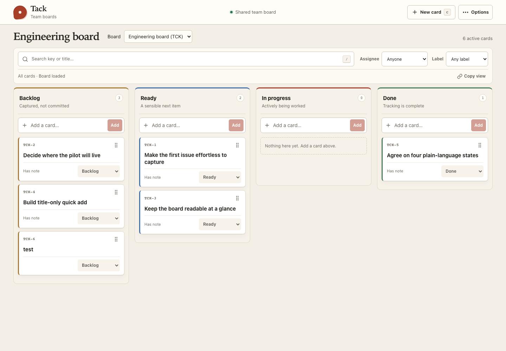
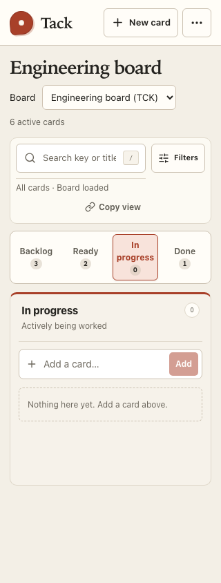
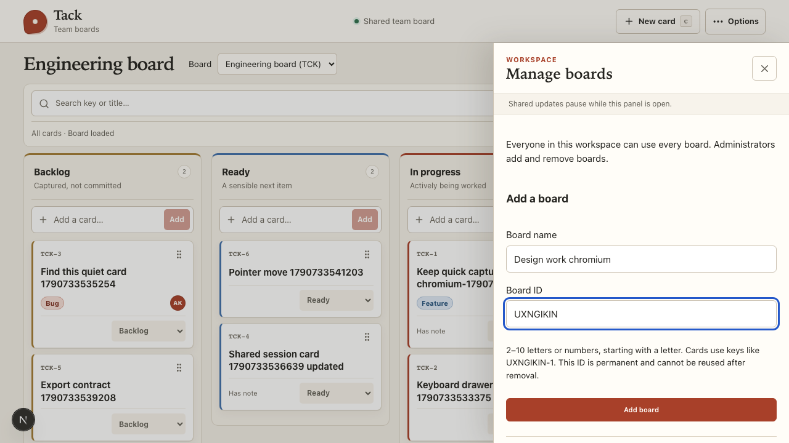
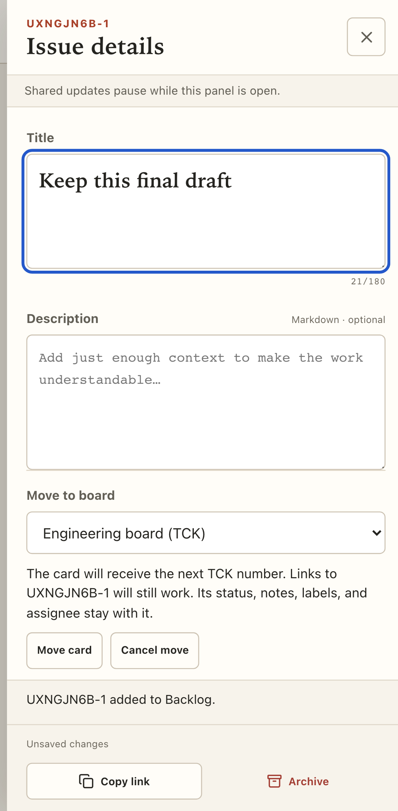
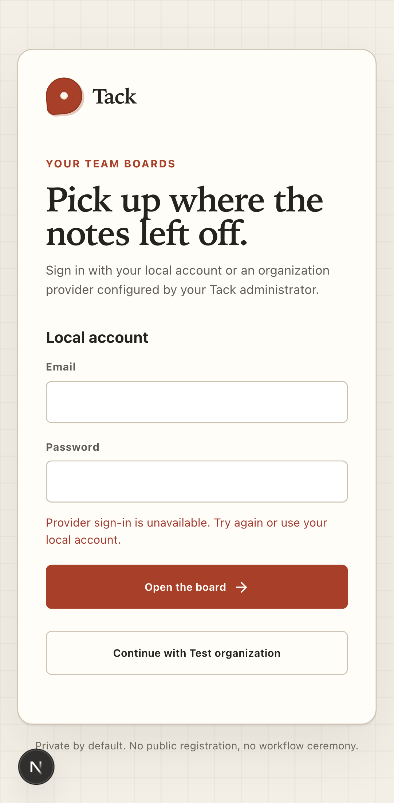

# Multiple boards and organization sign-in

Delivered locally on 2026-09-29. Review at [localhost:3000](http://localhost:3000) with the existing local account.

## What changed

- Local accounts remain the default. Administrators can configure Cognito User Pools or other OIDC providers, and optionally put an organization provider first while retaining local login.
- The board selector switches among workspace boards. Administrators add/remove boards through **Options → Manage boards**; every member can work in every board.
- Each board has a permanent short ID and its own card sequence, such as `ENG-1`. The original board is `TCK` and keeps its existing keys.
- Moving an active or archived card allocates a destination key, preserves its content and metadata, and keeps every former link working. The editor saves pending changes before transferring.
- Removal requires an empty board, including archived cards. The final board cannot be removed, and removed IDs remain reserved.
- JSON exports are version 2 and include boards, counters, and historical keys. CSV includes board IDs and previous keys.

Usage and setup: [Boards](../BOARDS.md), [Authentication](../AUTHENTICATION.md).

## Verification

| Check | Result |
| --- | --- |
| PostgreSQL/domain/auth/config/export tests | 33 passed across six files |
| Desktop and mobile Chromium | 59 passed; five intentional duplicates skipped |
| TypeScript and ESLint | Passed |
| Docker production build | Passed |
| Production app and PostgreSQL health | Healthy; HTTP health endpoint 200 |
| Existing local data | All six cards and label associations preserved exactly, apart from the new TCK board field |
| Local login after migration | Passed with the existing account |
| Production rendering | Inspected at 1440 and 320 CSS pixels; no page exceptions or narrow-width overflow |

The browser suite exercises creation, switching, transfer with unsaved edits, archived-card transfer failure/retry, old links after board removal, empty/last-board protection, member/admin authorization, stale links, and provider failure with local fallback. Existing save/recovery, shared state, export, keyboard, responsive, enlarged-text, and accessibility checks remain in the full suite.

Identity tests use the installed Better Auth handler and a local test issuer with a real authorization-code exchange and PKCE. They verify state/replay rejection, verified-email account linking, optional member provisioning, disabled-account denial, and callback destination restrictions. **No live Cognito tenant has been connected or accepted.** Its callback, issuer, app client, and credentials must be configured for the actual environment as described in the setup guide.

The normal local database was backed up to `backups/tack-before-boards-20260929.dump` before migration. The previous image remains tagged `min_iss-app:before-boards-20260929`. Rollback requires both that database backup and the earlier image. Backups and environment files are excluded from new Docker images. No test boards or cards were added to the normal application schema.

## Screenshots

The first two images use the unchanged local review data. The remaining images use isolated browser-test fixtures; the provider shown is a test configuration, not a connected organization account.

### Local review board

### Board administration and transfers

### Provider recovery

## Boundaries

Boards share workspace membership and labels. Per-board access controls, provider group-to-role mapping, and provider-wide SSO logout are not included. Signing out ends Tack's session. Live AWS acceptance, screen-reader testing, other browser engines, and real-device testing remain outstanding. Automated accessibility results support the tested contexts and are not a conformance claim.
