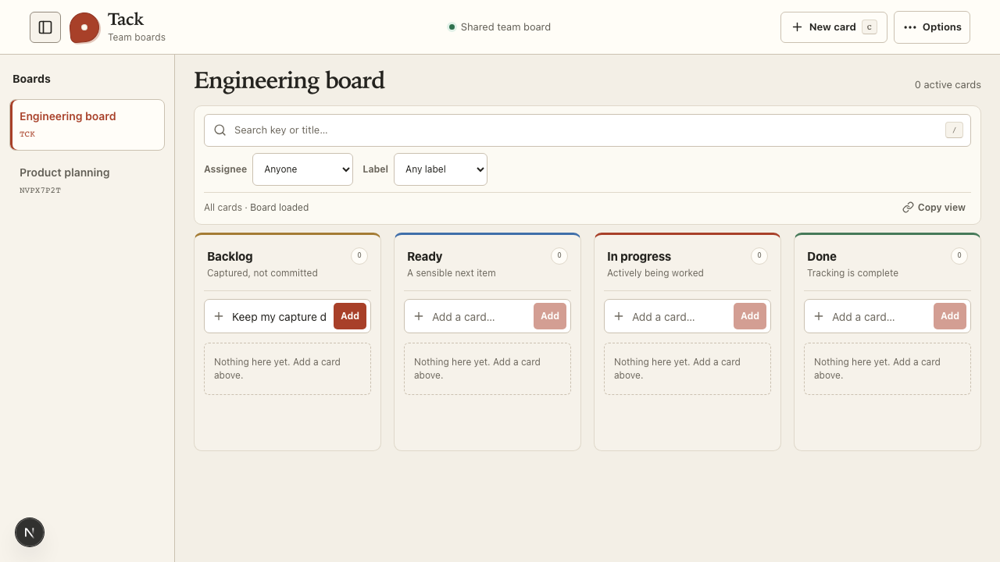
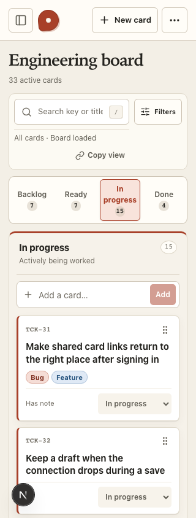
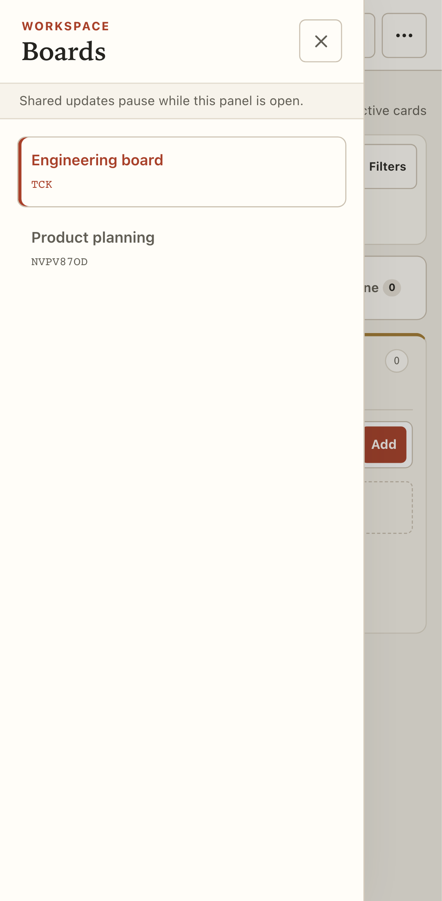

# Collapsible board navigation

2026-10-01

Board selection now lives in a left panel, separate from the board title and card tools. Every entry shows the board name and its immutable ID; the current board is highlighted.

- On desktop widths above 1100 CSS pixels, the panel starts visible. The panel icon beside the Tack logo collapses it; the duplicate panel collapse button has been removed. The board fills the released space, and the desktop preference persists in browser storage.
- At narrower widths, navigation starts closed. The panel icon opens a modal from the left. Keyboard focus stays inside; Escape or the close button dismisses it and returns focus to the opener.
- Switching uses client-side navigation: the current board stays visible with an “Opening board…” indicator until the destination is ready. Board controls pause during that transition, and browser Back/Forward works without a full-page reload.
- Switching retains the existing protection against discarding unfinished quick-capture titles. Pending writes disable board destinations. Card details retain their existing save/recovery workflow and block background navigation while open.
- Board creation/removal remain in Options → Manage boards. No data model, keys, permissions, or authentication settings changed.

## Rendered evidence

These screenshots use isolated browser-test data.

## Verification

The full Chromium desktop/mobile run passed 60 checks with five intentional duplicate skips and identified a focus-return issue in the new mobile panel check. After fixing the timing of focus restoration, both focused panel checks passed. Those checks cover persisted desktop collapse, released board width, current-board indication, mobile focus containment and Escape, cancelled draft discard, and successful switching in both directions. Axe scans of the panel passed. Existing seven-width and enlarged-text checks also passed. Typecheck, lint, and the production Docker build passed.

The rebuilt localhost application was also checked at 1440 and 320 pixels. Desktop collapse persisted after reload, mobile Escape restored focus, no page errors were reported, and the current board snapshot was unchanged by the checks. Production examples: [expanded desktop](evidence/sidebar/local-desktop.png), [collapsed desktop](evidence/sidebar/local-collapsed.png), [mobile panel](evidence/sidebar/local-mobile.png).

### Follow-up: single collapse control and in-place switching

Removed the desktop panel's duplicate collapse button; the header remains the single desktop toggle. The narrow-screen modal retains its close button because the background header is inactive while that dialog is open.

Eight desktop/mobile board checks passed after switching to Next.js client navigation. The navigation test holds the destination response to verify loading feedback and disabled controls, confirms the same browser document survives switching, and checks Back/Forward without document requests. Cancelled draft discard, successful switching, board creation/removal, transfer aliases, and authorization remain covered.
